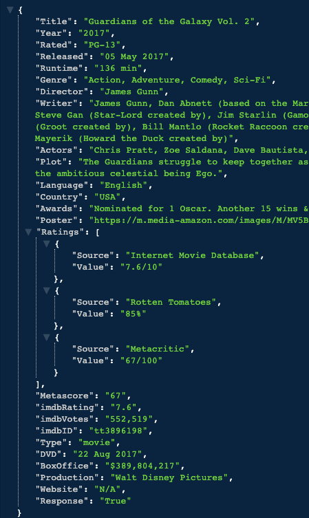

# W04D05-HW

### 1. TBD - EST TIME: 2 - 5hrs

- Continue to work through [Korilla Receipts](./korilla.md)
- When completed submit your homework [here](https://docs.google.com/forms/u/1/d/1pyy5-MMDmUkkupg8m659ZGNawQpGFz71HSXcv_xAx2g/edit). 
- In preparation for next the class on pulling data remotely go to the OMDB web site and 
[request a Free api key](http://www.omdbapi.com/apikey.aspx).   You can test that the key works by replacing the key below with your key and then pasting and entire string in the browser: `http://www.omdbapi.com/?apikey=9999999&t=Eraserhead`

> NOTE: you need everything up to the `=` and everything including the `&` and after

> `http://www.omdbapi.com/?apikey=[APIkeyGoesHere]&t=Eraserhead`

what does the response look like?

 

 

### 2. Read The Following - EST TIME: 1hr

 
 **BONUS**
- Read: [David Walsh's Blog - The Fetch API](https://davidwalsh.name/fetch)
- Read: [React Hooks To Fetch Data](https://www.robinwieruch.de/react-hooks-fetch-data) but only the following sections:
  - DATA FETCHING WITH REACT HOOKS
  - HOW TO TRIGGER A HOOK PROGRAMMATICALLY
  

### 3. Algo Practice - EST TIME: 20min

- Work through [Search insert position](./algorithms-homework.md) 

### 4.  Interview Practice - EST TIME: 20min

- Add and answer the following question: 
   - **Explain the difference between the onSubmit and onChange event and how are they used together in React. Give one or more examples..**.
- All answers must be at least a paragraph in length however the more you write the more you have to talk about.

